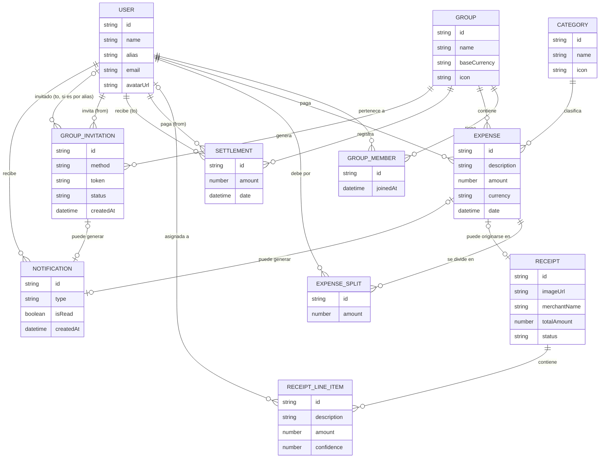
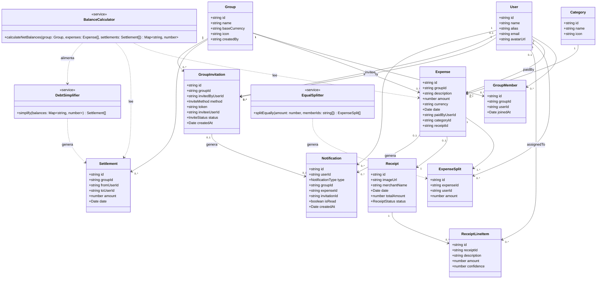

# Documentación inicial — Debtshare

Gestión de gastos compartidos con escaneo de tickets. Documento de referencia para el desarrollo del front-end (y contrato conceptual con el backend).

---

## 1. Visión general

Debtshare permite a un grupo de personas (piso compartido, viaje, cuadrilla de amigos) registrar gastos comunes, dividirlos a partes iguales entre los miembros, escanear tickets físicos para no tener que introducir los datos a mano, y saber en todo momento quién le debe dinero a quién — con el mínimo número de transacciones posible para saldar todas las deudas del grupo.

**Diferenciales frente a un Tricount/Splitwise estándar:**

- Escaneo de ticket con revisión asistida (campos de baja confianza marcados) y división del gasto **por línea de producto**, no solo por el total.
- Dashboard de analíticas por grupo (categoría, evolución temporal, comparativa entre miembros) **y también a nivel de perfil de usuario**, agregando todos sus grupos.
- Doble vía de invitación a grupos: enlace compartible o búsqueda por alias dentro de la app.

---

## 2. Actores

| Actor                   | Descripción                                                                                                                                       |
| ----------------------- | ------------------------------------------------------------------------------------------------------------------------------------------------- |
| **Usuario autenticado** | Persona que inicia sesión con Google (mock) y pertenece a uno o varios grupos.                                                                    |
| **Miembro de grupo**    | Usuario dentro del contexto de un grupo concreto. No existe distinción de roles: todos los miembros tienen las mismas capacidades sobre el grupo. |
| **Sistema OCR (mock)**  | Servicio simulado que procesa la imagen de un ticket y devuelve datos extraídos con nivel de confianza.                                           |

No hay jerarquía de ningún tipo en el MVP — ni administrador global ni owner/member dentro de un grupo.

---

## 3. Alcance del MVP

**Dentro de alcance:** todo lo listado en la sección 4.
**Fuera de alcance del MVP** (documentado para que quede claro que es una decisión, no un olvido):

- Pagos reales / integración bancaria o con Bizum, PayPal, etc.
- Notificaciones push o por email (la sección de notificaciones del MVP es únicamente in-app).
- Multi-idioma (se construye con arquitectura preparada para i18n, pero solo se implementa español).
- Cualquier sistema de roles o permisos (no hay distinción owner/member ni niveles de aprobación de gastos).
- División de gastos por porcentaje/importe exacto/partes — el MVP fija la división a partes iguales; queda como posible v2.
- Exportación contable/fiscal (facturas, IVA deducible).
- Modo offline completo (solo se contemplan estados de "sin conexión" en la UI, no sincronización offline-first).

---

## 4. Requisitos funcionales

### Autenticación y sesión

- **RF-01**: El sistema debe permitir iniciar sesión con Google (mock de OAuth: pantalla de selección de cuenta simulada, sin backend real).
- **RF-02**: El sistema debe proteger las rutas de la app y redirigir a login si no hay sesión activa.

### Grupos

- **RF-03**: El usuario debe poder crear un grupo indicando nombre, moneda base, e icono/color.
- **RF-04**: El usuario debe poder generar un **enlace de invitación** a un grupo, compartible fuera de la app.
- **RF-05**: El usuario debe poder invitar a un miembro **buscándolo por su alias dentro de la app** (sin salir de Debtshare).
- **RF-06**: El usuario debe poder ver el listado de todos sus grupos con un resumen de su balance en cada uno.
- **RF-07**: El usuario debe poder cambiar de grupo activo desde cualquier pantalla (selector tipo workspace switcher).

### Gastos

- **RF-08**: El usuario debe poder crear un gasto manualmente indicando descripción, importe, moneda, fecha, categoría y quién pagó.
- **RF-09**: El sistema debe dividir el importe del gasto **siempre a partes iguales** entre los miembros incluidos, recalculando automáticamente al incluir/excluir a alguien.
- **RF-10**: El usuario debe poder excluir a miembros concretos del grupo de un gasto específico.
- **RF-11**: El sistema debe soportar gastos en una moneda distinta a la moneda base del grupo, mostrando el importe convertido (tasa simulada).
- **RF-12**: El usuario debe poder editar y eliminar un gasto existente.
- **RF-13**: El usuario debe poder ver el histórico de gastos del grupo agrupado cronológicamente.

### Escaneo de tickets

- **RF-14**: El usuario debe poder subir una imagen de ticket (drag & drop o selector de archivo).
- **RF-15**: El sistema debe simular el procesamiento OCR y devolver: comercio, fecha, importe total y líneas de producto, cada campo con un nivel de confianza.
- **RF-16**: El usuario debe poder revisar y corregir manualmente cualquier campo extraído antes de confirmar, con aviso visual en los campos de baja confianza.
- **RF-17**: El usuario debe poder convertir un ticket revisado directamente en un gasto del grupo.
- **RF-18**: El usuario debe poder asignar líneas de producto individuales del ticket a subconjuntos de miembros del grupo; cada línea se divide a partes iguales entre los miembros asignados a ella.

### Balances y liquidación

- **RF-19**: El sistema debe calcular, para cada grupo, el balance neto de cada miembro (cuánto ha pagado de más o de menos respecto a lo que le corresponde).
- **RF-20**: El sistema debe simplificar las deudas del grupo al mínimo número de transacciones necesario para saldarlas todas (no simplificación par a par).
- **RF-21**: El usuario debe poder marcar una deuda como liquidada ("Settle up"), registrando el settlement correspondiente.
- **RF-22**: El sistema debe reflejar la actualización de balances inmediatamente tras una liquidación.

### Notificaciones

- **RF-23**: El sistema debe ofrecer una sección de notificaciones accesible desde la navegación principal, organizada en dos pestañas: **Actividad** e **Invitaciones**.
- **RF-24**: La pestaña de Actividad debe listar los nuevos gastos añadidos a cualquiera de los grupos del usuario (quién lo añadió, en qué grupo, importe).
- **RF-25**: La pestaña de Invitaciones debe listar las invitaciones pendientes a grupos (tanto las recibidas por alias como las derivadas de un enlace usado), permitiendo aceptarlas o rechazarlas directamente ahí.
- **RF-26**: El sistema debe mostrar un indicador de notificaciones no leídas (badge) en la navegación principal.
- **RF-27**: El usuario debe poder marcar notificaciones como leídas, individualmente o todas a la vez.

### Dashboard y analíticas

- **RF-28**: Cada grupo debe tener su propio dashboard con: gasto total en un rango de fechas, desglose por categoría, evolución temporal del gasto, y comparativa de aportación entre miembros.
- **RF-29**: El perfil de usuario debe incluir su propia sección de analíticas, agregando datos de **todos** sus grupos: gasto total, desglose por categoría, y comparativa por grupo — **sin** gráfica de evolución temporal (esa queda reservada al dashboard de cada grupo).

### Transversales

- **RF-30**: El sistema debe ofrecer una paleta de comandos (Cmd/Ctrl+K) para navegar y crear un gasto rápidamente desde cualquier pantalla.
- **RF-31**: El sistema debe mostrar estados de carga, vacío y error diseñados específicamente para cada contexto (no genéricos).
- **RF-32**: El sistema debe soportar modo claro y oscuro.

---

## 5. Requisitos no funcionales

| ID     | Requisito                                                                                                                                                        |
| ------ | ---------------------------------------------------------------------------------------------------------------------------------------------------------------- |
| RNF-01 | La UI debe ser completamente responsive (mobile-first en las pantallas de creación de gasto y escaneo de ticket).                                                |
| RNF-02 | Accesibilidad: cumplir WCAG 2.1 AA en los flujos críticos (contraste, foco visible, roles ARIA, navegación por teclado).                                         |
| RNF-03 | Rendimiento: lazy loading por ruta, bundle inicial bajo el umbral definido en `size-limit` (ver documentación de CI/CD).                                         |
| RNF-04 | Toda mutación de datos (crear/editar/borrar) debe dar feedback optimista con posibilidad de rollback si el mock devuelve error.                                  |
| RNF-05 | El código debe mantener cobertura de tests mínima definida en CI (ver Sección 1B del prompt maestro) y pipeline en verde antes de cada merge.                    |
| RNF-06 | La capa de acceso a datos debe estar desacoplada (api client + hooks) para poder sustituir los mocks por el backend real sin tocar componentes.                  |
| RNF-07 | La app debe respetar `prefers-reduced-motion` en todas las animaciones.                                                                                          |
| RNF-08 | El sistema debe soportar al menos 3 idiomas a nivel de arquitectura aunque solo se traduzca a español en el MVP (strings centralizados, no hardcodeados en JSX). |

---

## 6. Casos de uso principales

### UC-01 — Crear un gasto manual

- **Actor**: Miembro de grupo.
- **Precondición**: El usuario está dentro de un grupo con al menos 2 miembros.
- **Flujo principal**:
  1. El usuario pulsa "Añadir gasto" (o lo invoca desde la paleta de comandos).
  2. Introduce descripción, importe, categoría, fecha y quién pagó.
  3. El sistema divide automáticamente el importe a partes iguales entre los miembros incluidos; el usuario puede excluir a alguno y el reparto se recalcula al instante.
  4. El usuario confirma; el gasto aparece de inmediato en el feed (optimistic update) y se genera una notificación de "nuevo gasto" para el resto de miembros.
- **Flujo alternativo**: si el mock devuelve error al guardar, se revierte el gasto del feed y se muestra un toast de error con opción de reintentar.
- **Postcondición**: El gasto queda registrado y los balances del grupo se recalculan.

### UC-02 — Escanear un ticket y convertirlo en gasto

- **Actor**: Miembro de grupo.
- **Flujo principal**:
  1. El usuario sube una foto del ticket.
  2. El sistema simula el procesamiento OCR (con feedback de progreso por pasos).
  3. Se muestra la pantalla de revisión: imagen del ticket + campos extraídos editables, con los de baja confianza resaltados.
  4. El usuario corrige lo necesario y, opcionalmente, asigna líneas de producto a subconjuntos de miembros (cada línea se reparte a partes iguales entre los asignados a ella).
  5. El usuario confirma y el ticket se convierte en un gasto del grupo, prellenado.
- **Postcondición**: Se crea un gasto vinculado al ticket original (imagen accesible desde el detalle del gasto).

### UC-03 — Liquidar deudas del grupo

- **Actor**: Miembro de grupo.
- **Precondición**: Existen balances pendientes en el grupo.
- **Flujo principal**:
  1. El usuario accede a la vista de Balances.
  2. El sistema muestra el resultado ya simplificado (mínimo número de transacciones).
  3. El usuario marca una de las transacciones sugeridas como liquidada.
  4. El sistema registra el settlement y recalcula los balances restantes.
- **Postcondición**: El balance entre esos dos miembros queda a cero (o reducido si la liquidación fue parcial).

### UC-04 — Invitar a un miembro a un grupo

- **Actor**: Miembro de grupo.
- **Flujo principal (vía alias)**:
  1. El usuario busca a otro usuario por su alias dentro de la app.
  2. El sistema genera una invitación pendiente y una notificación en la pestaña "Invitaciones" del invitado.
  3. El invitado la acepta o la rechaza desde su sección de notificaciones.
- **Flujo alternativo (vía enlace)**:
  1. El usuario genera un enlace de invitación al grupo y lo comparte fuera de la app.
  2. Cualquiera que abra el enlace y tenga sesión iniciada ve una pantalla de "Unirse al grupo X" y confirma.
- **Postcondición**: El usuario invitado pasa a ser miembro del grupo con las mismas capacidades que el resto (no hay roles).

### UC-05 — Revisar notificaciones

- **Actor**: Usuario autenticado.
- **Flujo principal**:
  1. El usuario abre la sección de Notificaciones.
  2. Cambia entre la pestaña Actividad (gastos nuevos en sus grupos) e Invitaciones (invitaciones pendientes).
  3. Desde Invitaciones, acepta o rechaza directamente; desde Actividad, puede navegar al gasto correspondiente.
- **Postcondición**: Las notificaciones vistas quedan marcadas como leídas y el badge se actualiza.

---

## 7. Modelo de dominio

---

## 8. Diagrama de clases (orientado a los tipos de dominio en TypeScript)

**Nota de arquitectura**: `DebtSimplifier`, `BalanceCalculator` y `EqualSplitter` no son clases con estado — son funciones puras en `shared/lib/`, representadas aquí como "clases de servicio" solo para dejar explícita su responsabilidad dentro del dominio. En el código real serán funciones testeables de forma aislada (ver Sección 7 del prompt maestro).

---

## 9. Reglas de negocio clave

1. La suma de todos los `ExpenseSplit` de un `Expense` debe ser exactamente igual a `Expense.amount`. Como el reparto es siempre a partes iguales, cuando el importe no es divisible exactamente entre el número de miembros incluidos, los céntimos sobrantes se asignan a quien pagó el gasto, para que la suma cuadre siempre céntimo a céntimo.
2. Todos los miembros de un grupo tienen las mismas capacidades — no existe ninguna distinción de roles ni de permisos entre ellos.
3. El balance neto de un miembro = suma de lo que ha pagado − suma de lo que le corresponde pagar según sus splits ± settlements ya realizados.
4. La simplificación de deudas debe minimizar el **número de transacciones**, no el importe total movido — son objetivos distintos y el algoritmo debe optimizar explícitamente por el primero.
5. Un `ReceiptLineItem` con `confidence` por debajo del umbral definido (sugerido: 0.75) debe marcarse visualmente como "a revisar" y no puede confirmarse sin que el usuario lo haya tocado o confirmado explícitamente.
6. La moneda de un gasto puede diferir de la moneda base del grupo; los balances del grupo siempre se calculan y muestran en la moneda base, aplicando la tasa de conversión vigente en el momento del gasto (no la actual).
7. Una `GroupInvitation` por alias queda en estado `PENDING` hasta que el invitado la acepta o la rechaza desde su sección de notificaciones; una invitación por enlace se resuelve en el propio momento en que se abre el enlace (no genera un estado pendiente intermedio).
8. Al crear un `Expense`, el sistema genera una `Notification` de tipo actividad para cada miembro del grupo excepto quien lo creó.
9. Al aceptar una `GroupInvitation`, se crea el `GroupMember` correspondiente y la notificación asociada deja de aparecer como pendiente en la pestaña de Invitaciones.

---

## 10. Siguientes pasos

Este documento es la referencia funcional para todas las secciones del prompt maestro de construcción. Antes de empezar la Sección 5 (núcleo de grupos y gastos) conviene tenerlo ya cerrado, ya que de aquí salen los tipos de dominio de la Sección 1 y las entidades mockeadas de la Sección 3.
